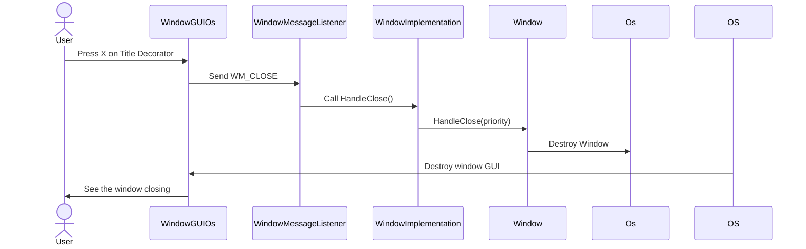
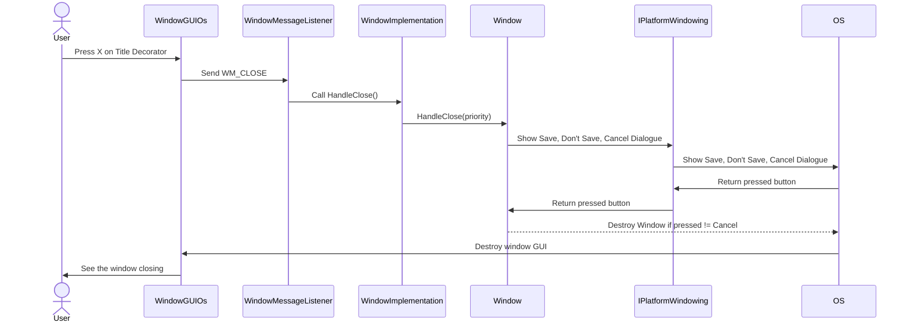

Normal Close

```mermaid
sequenceDiagram
    actor User
    participant WindowGUIOs
    participant WindowMessageListener
    participant WindowImplementation
    participant Window
    
    User->>WindowGUIOs:Press X on Title Decorator
    WindowGUIOs->>WindowMessageListener: Send WM_CLOSE
    WindowMessageListener->>WindowImplementation: Call HandleClose()
    WindowImplementation->>Window: HandleClose(priority)
    Window->>Os: Destroy Window
    OS->>WindowGUIOs: Destroy window GUI
    WindowGUIOs->>User: See the window closing
```

Overriden Close (Example for save before closing)

```mermaid
sequenceDiagram
    actor User 
    participant WindowGUIOs
    participant WindowMessageListener
    participant WindowImplementation
    participant Window
    
    User->>WindowGUIOs:Press X on Title Decorator
    WindowGUIOs->>WindowMessageListener: Send WM_CLOSE
    WindowMessageListener->>WindowImplementation: Call HandleClose()
    WindowImplementation->>Window: HandleClose(priority)
    Window->>IPlatformWindowing: Show Save, Don't Save, Cancel Dialogue
    IPlatformWindowing->>OS: Show Save, Don't Save, Cancel Dialogue
    OS->>IPlatformWindowing: Return pressed button
    IPlatformWindowing->>Window: Return pressed button
    Window-->>OS: Destroy Window if pressed != Cancel
    OS->>WindowGUIOs: Destroy window GUI
    WindowGUIOs->>User: See the window closing
```